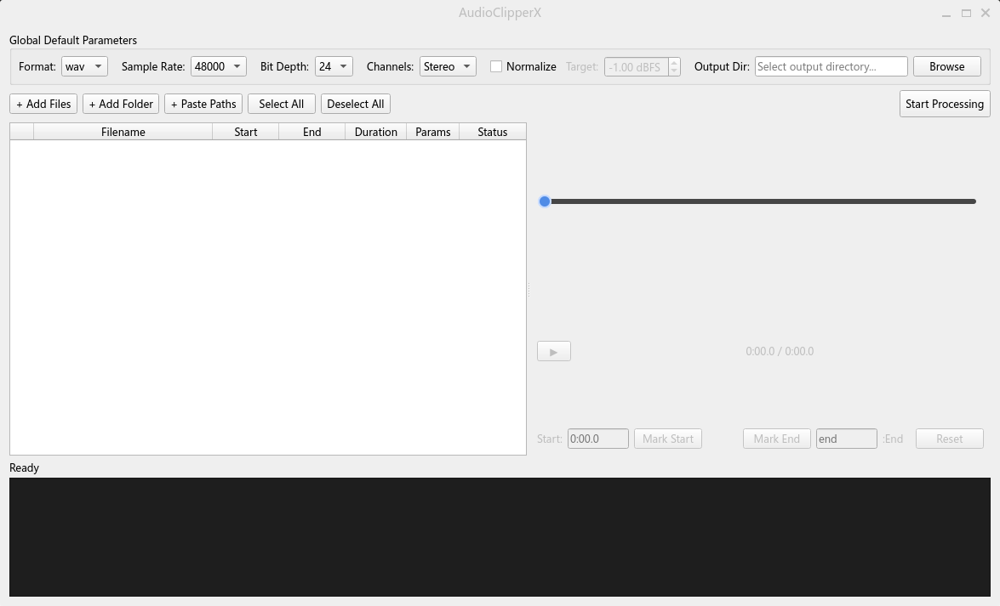

# AudioClipperX

A Python desktop tool for trimming audio clips, converting formats, and batch-processing audio/video files — all from a clean GUI.



---

## Features

- **Trim audio** — set start and end points by dragging handles on the timeline, clicking "Mark Start / Mark End" while playing, or typing times directly
- **Format conversion** — output to WAV, MP3, FLAC, OGG, AAC, M4A
- **Sample rate & bit depth** — configurable per file (e.g. 48 kHz / 24-bit for car audio systems)
- **Channel control** — Mono or Stereo
- **Volume normalization** — peak-normalize all outputs to a target dBFS level
- **Video input** — automatically extracts the audio track from MP4, MKV, AVI, MOV, and other video formats
- **Batch processing** — queue any number of files; each file can override the global defaults
- **Parallel processing** — uses all CPU cores via `ProcessPoolExecutor`; the UI stays responsive throughout
- **Real-time log** — per-file progress and gain details printed as processing runs
- **Flexible file loading** — Add Files dialog, Add Folder scan, drag-and-drop onto the list, or paste paths manually (useful on WSL2 where directory listing can fail)

---

## Requirements

- [Anaconda](https://www.anaconda.com/) or Miniconda
- FFmpeg (installed via conda — see below)
- Python 3.11+

---

## Installation

### 1. Clone the repository

```bash
git clone https://github.com/yourname/AudioClipperX.git
cd AudioClipperX
```

### 2. Create the conda environment

```bash
conda env create -f environment.yml
conda activate audioclipperx
```

`environment.yml` installs Python 3.11, FFmpeg, and all Python dependencies automatically.

### 3. Install the package in editable mode

```bash
pip install -e .
```

---

## Running

```bash
conda activate audioclipperx
python -m audioclipperx.main
```

---

## Usage

### Main window overview

```
┌─ Global Default Parameters ──────────────────────────────────────────────┐
│  Format  Sample Rate  Bit Depth  Channels  Normalize  Output Dir         │
├───────────────────────────────────────────────────────────────────────────┤
│  [+ Add Files] [+ Add Folder] [+ Paste Paths] [Select All] [Deselect All]│
│                                                    [Start Processing]     │
├──────────────────────────────┬────────────────────────────────────────────┤
│  File list                   │  Player                                    │
│  ☑ Filename  Start  End  … │  ──●══════════════●──────────────────────  │
│  ☑ file1.mp3                │  ▶   0:01.2 / 0:08.0                       │
│  ☑ file2.mp4                │  Start: [0:01.2]  [Mark Start]             │
│  ☐ file3.mp3                │        [Mark End]  [Reset]  End: [0:06.0]  │
├──────────────────────────────┴────────────────────────────────────────────┤
│  Processing: 2/5  ████████░░░░░░░                                         │
│  [10:32:01] Processing: file1.mp3                                         │
│  [10:32:02] Trimming: 0.00s → 5.00s (duration 5.00s)                     │
│  [10:32:02] Done ✓ → file1.wav                                            │
└───────────────────────────────────────────────────────────────────────────┘
```

### Step-by-step

#### 1. Set global output parameters

At the top of the window, configure the defaults that apply to all files:

| Setting | Description |
|---------|-------------|
| Format | Output container: `wav`, `mp3`, `flac`, `ogg`, `aac`, `m4a` |
| Sample Rate | e.g. `48000` Hz |
| Bit Depth | `16`, `24`, or `32` bit (WAV only) |
| Channels | `Mono` or `Stereo` |
| Normalize | Tick to peak-normalize; set the target level in dBFS (default `-1.0`) |
| Output Dir | Folder where all output files are written |

#### 2. Add files

| Button | Behaviour |
|--------|-----------|
| **+ Add Files** | Open a file picker to select individual audio/video files |
| **+ Add Folder** | Scan a folder and add all supported audio/video files found in it |
| **+ Paste Paths** | Type or paste absolute file paths, one per line — useful on WSL2 |
| **Drag & drop** | Drop files directly onto the file list |

Supported input formats: `.mp3` `.wav` `.flac` `.ogg` `.aac` `.m4a` `.wma` `.opus` `.mp4` `.mkv` `.avi` `.mov` `.flv` `.wmv` `.webm` `.m4v` `.ts`

#### 3. Set clip range for each file

Click a row in the file list to load it in the player, then:

- **Drag the handles** on the timeline bar to set start and end points
- **Play** the file and click **Mark Start** / **Mark End** to capture the current playback position
- **Type** a time directly into the Start or End fields and press Enter

  Accepted time formats:

  | Input | Meaning |
  |-------|---------|
  | `90` | 90 seconds |
  | `90.5` | 90.5 seconds |
  | `1:30` | 1 min 30 s |
  | `1:30.5` | 1 min 30.5 s |
  | `0:01:30` | 1 min 30 s (H:MM:SS) |

- Press **Reset** to restore the range to the full file duration

The file list updates the Start, End, and Duration columns immediately.

#### 4. Per-file parameter overrides

Right-click any row in the file list to open a context menu:

| Menu item | Action |
|-----------|--------|
| Remove from List | Remove the entry — the original file is **never** deleted |
| Edit Parameters… | Override format, sample rate, bit depth, channels, normalize, and output directory for this file only |
| Reset to Global Defaults | Discard any per-file overrides |
| Select All / Deselect All | Toggle the checkbox for every file |

Files with custom parameters are highlighted in blue in the **Params** column.

#### 5. Process

1. Make sure at least one file is checked (☑) in the list
2. Confirm **Output Dir** is set in the global settings
3. Click **Start Processing**

The UI locks during processing. Each file is handled in a separate worker process. Progress and log output appear in real time. A summary dialog shows how many files succeeded or failed, with error details for any failures.

---

## Example: BYD car lock sound

The BYD Encore custom lock sound requires:

| Requirement | Value |
|-------------|-------|
| Format | WAV |
| Sample rate | 48000 Hz |
| Bit depth | 24 bit |
| Max duration | 5 seconds |

Set these in the Global Default Parameters panel, trim each clip to under 5 seconds using the player, enable **Normalize** if needed, then click **Start Processing**.

---

## Notes on WSL2

Running under WSL2 with files on a Windows drive (`/mnt/c/`, `/mnt/e/`, …) can cause intermittent directory I/O errors. If **+ Add Folder** fails, use **+ Paste Paths** and paste the full paths manually.

---

## Project structure

```
AudioClipperX/
├── audioclipperx/
│   ├── main.py          # Entry point; CJK font setup for Chinese filenames
│   ├── models.py        # Data classes (FileEntry, FileParams, AudioTask, …)
│   ├── processor.py     # Core audio processing (runs in subprocess workers)
│   ├── worker.py        # QThread wrapper around ProcessPoolExecutor
│   └── ui/
│       ├── main_window.py
│       ├── file_list.py
│       ├── player_widget.py
│       ├── range_slider.py
│       ├── settings_panel.py
│       ├── params_dialog.py
│       └── log_panel.py
├── data/
│   ├── input/           # Source files (git-ignored)
│   └── output/          # Processed files (git-ignored)
├── environment.yml
└── setup.py
```

---

## License

MIT
